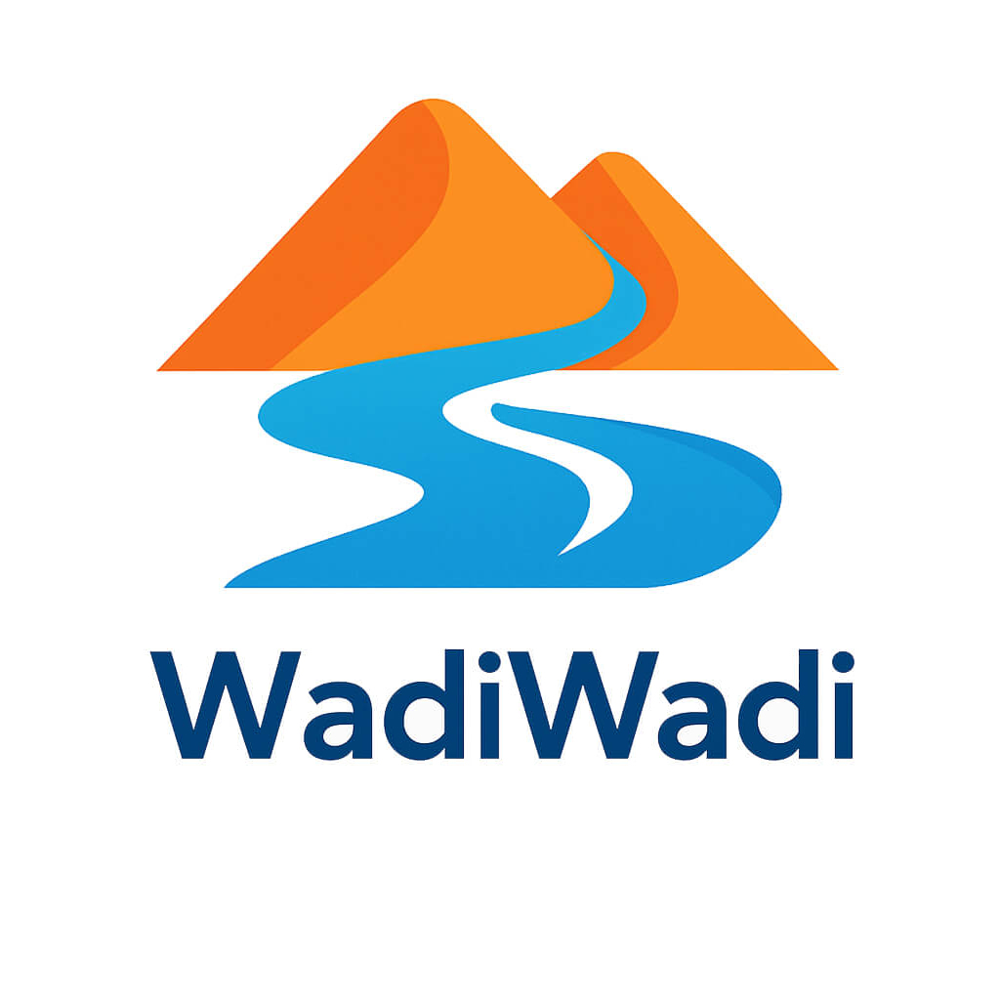

<h1 align="center">
  
</h1>
<p align="center">
  <a href="https://www.youtube.com/@wadiwadi_ai" target="_blank">
    
  </a>
</p>
<p align="center">
  <strong>Your ideas, flowing into reality with the power of AI.</strong>
</p>

<p align="center">
    <a href="https://www.youtube.com/@wadiwadi_ai">
        
    </a>
    
    
    <a href="LICENSE">
        
    </a>
</p>

---

### Core Philosophy

**Wadi Wadi** is built on a single, powerful belief: **AI is the great equalizer.**

For years, the power to create software, automate tasks, and build custom tools belonged exclusively to developers. This project is about changing that. We believe that with the right guidance and the new generation of AI tools, anyone with a problem and an idea can become a builder.

This isn't about becoming a traditional programmer. It's about becoming a **problem-solver in the age of AI**. It's about teaching you how to partner with artificial intelligence to turn your unique frustrations and brilliant ideas into tangible, working tools. We will show you the real, messy, and exciting process of creation—failures and all.

---

### The Mission

This repository and its accompanying YouTube channel serve as a public record of our journey. Our mission is to:

1.  **Build in Public:** Document the creation of personal, useful, AI-powered tools from scratch.
2.  **Empower the Curious:** Provide a clear, honest roadmap for non-developers to start building.
3.  **Embrace the Process:** Show the reality of development—the brilliant successes, the frustrating errors, and the critical moments of learning. Failure isn't just an option; it's a valuable part of our content.
4.  **Create a Community Toolkit:** This repository will house every tool we build. Fork them, use them, improve them. They are for you.

---

### The "Wadi Wadi" YouTube Show

Each video on our channel is a self-contained story of creation. We follow a "Golden Formula" to turn a simple build into a compelling journey.

<details>
<summary><strong>🎬 The Golden Formula (Our 5-Act Story Structure)</strong></summary>
<br>

1.  **The Human Problem (The Hook):** We start not with tech, but with a relatable human frustration. *"I have 50 browser tabs open and I can't find anything."*
2.  **The "What If?" Question (The Premise):** We frame the goal as an empowering question. *"What if an AI could read all my tabs and give me a one-sentence summary of each?"*
3.  **The Build (The "Messy Middle"):** The heart of the show. A fast-paced look at the real process—prompting the AI, pasting code, hitting errors, debugging with the AI's help, and the "aha!" moments.
4.  **The Reveal & Demo (The Climax):** The moment of truth. We run the final tool. Does it work? We show the result in a clean, satisfying way. If it failed, we analyze exactly why.
5.  **The Empowerment Takeaway (The "So What?"):** We connect it back to you. The code is in this repository. The skill is within your reach. **What problem will *you* solve?**

</details>

<details>
<summary><strong>💡 Potential Video Ideas</strong></summary>
<br>

*   **Productivity & Automation:**
    *   **AI Email Triage:** I built an AI to read my emails and tell me what's actually important.
    *   **The Subscription Killer:** I got tired of paying for subscriptions, so I built an AI to find me free alternatives.
    *   **The Automated Job Applicant:** A personal AI agent that finds and filters job postings for me.
*   **Creativity & Exploration:**
    *   **The AI Recipe Generator:** An app that creates meals from whatever is in my fridge.
    *   **The "What Should I Watch?" Bot:** An AI that gives me movie recommendations based on my specific mood, not just my viewing history.
*   **The "Honest Failure" Series:**
    *   **I Tried to Build an AI to Win My Fantasy Football League... And Here's Why It Failed.**
    *   **My AI Meeting Summarizer Was a Disaster (And I Learned More From It Than Any Success).**

</details>

---

### How to Use This Repository

This repository is the central hub for our community and every tool we create.

*   **Project Structure:** Each project (tool or workflow) has its own dedicated folder under `/tools` or `/workflows`. Inside each folder, you'll typically find:
    *   `README.md`: A detailed guide explaining what the project does and how to use it.
    *   Source code and configuration files.
    *   `CLAUDE.md` or `GEMINI.md`: Development notes and AI conversations.

*   **Repository Structure:**
    ```
    wadiwadi-free/
    ├── README.md                   # This file
    ├── LICENSE                     # MIT License
    ├── START.md                    # Getting started guide
    ├── docs/                       # General documentation
    ├── tools/                      # AI-powered browser extensions and tools
    └── workflows/                  # n8n automation workflows
    ```

*   **Get the Code:** To get started with a project, you can `git clone` this repository to your computer.
*   **Contribute:** Have an idea for a tool or an improvement? Open an "Issue" in the repository. We want this to be a collaborative space.

---

## 🛠️ Available Tools

This section includes AI-powered browser extensions and other custom-built tools.

### 001 - LinkedIn Profile Researcher
**📍 Location:** `/tools/001-linkedin-profile-researcher/`

A powerful Chrome extension that transforms LinkedIn profile research using AI. This tool demonstrates the complete journey from a simple idea to a production-ready browser extension.

**✨ Features:**
- 🔍 **AI-Powered Analysis:** Gemini 2.5 Pro/Flash models with 8192 token limit for comprehensive analysis
- 🌐 **Bilingual Research:** Generates detailed reports in both English and Arabic with language switching
- 📸 **Smart Screenshot Capture:** One-click profile analysis using Chrome's activeTab permissions
- 📊 **Professional Reports:** Detailed insights with executive summary, company research, and verification
- 💾 **Intelligent Caching:** 7-day local storage with automatic cleanup and access tracking
- 📄 **PDF Export:** Clean, printable reports with optimized page breaks and professional formatting
- 🎨 **Modern UI:** Glassmorphic design with real-time progress tracking and smooth animations
- 🔄 **Smart Positioning:** Results panel automatically moves to progress panel position after completion

**🏗️ Architecture:**
- **Modular Design:** Clean separation across 5 core components and 3 utility modules
- **Gemini AI Integration:** Multimodal analysis with automatic fallback and Google Search integration
- **Chrome Extension V3:** Manifest V3 compliance with proper permissions and service workers
- **Optimized Layout:** Single-scroll interface with flexbox layout and no double scrolling issues
- **Error Handling:** Comprehensive error recovery with user-friendly messages

**🚀 Status:** ✅ **Production Ready** - Fully functional with recent optimizations (June 2025)

**💡 What You'll Learn:**
- **Chrome Extension Development:** Manifest V3, service workers, content scripts, and permissions
- **AI API Integration:** Gemini API with multimodal analysis, fallback handling, and token optimization
- **Modern JavaScript:** ES6+ with async/await, modular architecture, and clean separation of concerns
- **UI/UX Design:** Glassmorphic interfaces, real-time progress tracking, and responsive layouts
- **Browser APIs:** Screenshot capture, storage management, and message passing
- **PDF Generation:** Print-optimized layouts with proper page breaks and typography
- **Debugging & Optimization:** Error handling, performance optimization, and production troubleshooting

**🔧 Recent Fixes & Optimizations (June 2025):**
- ✅ Increased API token limits from 2048 to 8192 for longer responses
- ✅ Fixed PDF export constructor loading issues  
- ✅ Implemented smart panel positioning after research completion
- ✅ Optimized layout to eliminate double scrolling with flexbox architecture
- ✅ Enhanced print styles for professional PDF output

This tool showcases the entire development lifecycle, from initial concept to a polished, production-ready application that solves a real-world problem—including the messy reality of debugging and continuous improvement.

---

## 🚀 Available Workflows

This section contains automation workflows for tools like n8n, designed to connect different apps and services to automate repetitive tasks.

### 000 - Self-Hosted n8n with Docker
**📍 Location:** `/workflows/000-setup-n8n/`

A simple setup to run your own instance of n8n locally using Docker. This is the foundation for building and testing custom automation workflows.

**✨ Features:**
- **Docker Compose:** One-command setup using `docker-compose.yml`.
- **Local Environment:** Perfect for developing and testing n8n workflows securely on your own machine.
- **Foundation for Automation:** The starting point for all n8n projects in this repository.

**💡 What You'll Learn:**
- **Docker Basics:** How to use Docker and Docker Compose to run services.
- **n8n Setup:** The fundamentals of getting an n8n instance running.
- **Self-Hosting:** The benefits of controlling your own automation platform.

<br>

<details>
<summary><strong>🛠️ The Tools of the Trade: Your Local AI Dev Setup</strong></summary>
<br>

We believe in empowering you with real, professional tools from day one. Instead of using a limited online editor, we will guide you in setting up a powerful local environment on your own machine. This gives you maximum flexibility and control.

Our **"Video Zero"** on the channel will be a dedicated guide walking you through this entire setup.

1.  **Code Editor: [Visual Studio Code](https://code.visualstudio.com/)**
    *   The industry-standard for a reason. It's free, powerful, and has a massive ecosystem of extensions.
2.  **Runtime: [Node.js](https://nodejs.org/)**
    *   The engine that allows us to run JavaScript (the language of the web) on our computer to build everything from web servers to automation scripts.
3.  **Version Control: [Git](https://git-scm.com/) & [GitHub](https://github.com/)**
    *   The fundamental system for tracking changes in code and sharing it. It's how you'll get the code from this repository onto your machine.
4.  **AI Partners: Command Line Interfaces (CLIs)**
    *   **[Gemini CLI](https://developers.google.com/gemini/tutorials/cli_quickstart)**: A powerful, free tool to interact with Google's Gemini models directly from our terminal.
    *   **[Claude Code CLI](https://www.npmjs.com/package/@anthropic-ai/claude-cli)**: An excellent alternative from Anthropic for generating code.

This setup puts you in the driver's seat, ready to tackle any project we explore on the channel.
</details>

<details>
<summary><strong>🎨 The Brand Kit</strong></summary>
<br>

#### Color Palette

| Name              | Hex       | RGB                 | HSL                    | Usage                                             |
| ----------------- | --------- | ------------------- | ---------------------- | ------------------------------------------------- |
| **Wadi Blue**     | `#0ea5e9` | `rgb(14, 165, 233)` | `hsl(200, 88%, 48%)`   | Primary brand color, CTAs, headers, main UI       |
| **Heritage Orange**| `#f97316` | `rgb(249, 115, 22)` | `hsl(24, 95%, 53%)`    | Secondary actions, highlights, cultural elements  |
| **Sunset Coral**  | `#fb923c` | `rgb(251, 146, 60)` | `hsl(27, 96%, 61%)`    | Warm accents, success states, friendly elements   |
| **Sky Light**     | `#f0f9ff` | `rgb(240, 249, 255)`| `hsl(200, 100%, 97%)` | Backgrounds, cards, subtle areas                  |
| **Deep Sea**      | `#0c4a6e` | `rgb(12, 74, 110)`  | `hsl(202, 80%, 24%)`   | Text, headers, high contrast elements             |

#### Typography

| Language | Family    | Weights             | Usage                                                  | Characteristics                                  |
| -------- | --------- | ------------------- | ------------------------------------------------------ | ------------------------------------------------ |
| **English**  | **Inter** | `300, 400, 500, 600, 700` | All English content, UI elements, technical docs       | Clean, modern, highly legible, tech-forward      |
| **Arabic**   | **Tajawal** | `300, 400, 500, 700` | All Arabic content, bilingual headers, cultural comms | Modern Arabic font, excellent readability, balanced |
</details>

---

### Get Involved

Wadi Wadi is more than a channel; it's a community experiment. Here's how you can be a part of it:

*   **[➡️ Subscribe to the YouTube Channel](https://www.youtube.com/@wadiwadi_ai)**
*   **[⭐ Star this Repository](https://github.com/happydreammmer/wadiwadi_free)**
*   **[💡 Suggest an Idea](https://github.com/happydreammmer/wadiwadi_free/issues/new)**

Let's start building.
